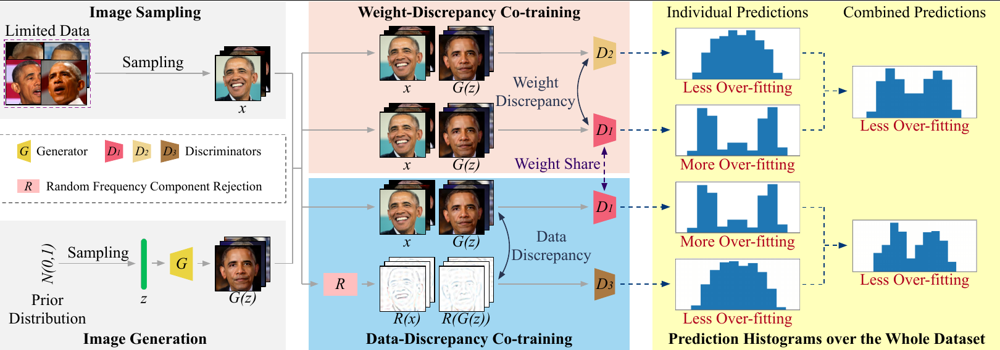

# GenCo: Generative Co-training for Generative Adversarial Networks with Limited Data

### Updates

## Paper

[GenCo: Generative Co-training for Generative Adversarial Networks with Limited Data](https://xxx.pdf)  
 Kaiwen Cui*, [Jiaxing Huang*](https://scholar.google.com/citations?user=czirNcwAAAAJ&hl=en&oi=ao), Zhipeng Luo, [Gongjie Zhang](https://scholar.google.com/citations?user=sRBTPp4AAAAJ&hl=en), [Fangneng Zhan](https://scholar.google.com/citations?user=8zbcfzAAAAAJ&hl=en&oi=ao),[Shijian Lu](https://scholar.google.com/citations?user=uYmK-A0AAAAJ&hl=en)
 
 *indicates equal contribution.
 
 School of Computer Science Engineering, Nanyang Technological University, Singapore  
 Thirty-Sixth AAAI Conference on Artificial Intelligence, 2022.
 


## Abstract
Training effective Generative Adversarial Networks (GANs) requires large amounts of training data, without which the trained models are usually sub-optimal with discriminator over-fitting. Several prior studies address this issue by expanding the distribution of the limited training data via massive and hand-crafted data augmentation. We handle data-limited image generation from a very different perspective. Specifically, we design GenCo, a Generative Co-training network that mitigates the discriminator over-fitting issue by introducing multiple complementary discriminators that provide diverse supervision from multiple distinctive views in training. We instantiate the idea of GenCo in two ways. The first way is Weight-Discrepancy Co-training (WeCo) which co-trains multiple distinctive discriminators by diversifying their parameters. The second way is Data-Discrepancy Co-training (DaCo) which achieves co-training by feeding discriminators with different views of the input images (e.g., different frequency components of the input images). Extensive experiments over multiple benchmarks show that GenCo achieves superior generation with limited training data. In addition, GenCo also complements the augmentation approach with consistent and clear performance gains when combined.

## Installation
1. Clone the repo:
```bash
git clone https://github.com/jxhuang0508/GenCo.git
```

2. Install environment from the environment.yml file:
```bash
conda env create -f GenCo.yml
```

### Pre-trained models
Pre-trained models can be downloaded [here](https://github.com/jxhuang0508/HCL/releases/tag/model) and put ```GTA5_HCL_source.pth``` into ```HCL/pretrained_models/HCL_source_only_426```, ```GTA5_HCL_target.pth``` into ```HCL/pretrained_models/HCL_target_482```. 

### Training and Evaluation with DA
To train and evaluate over 100-shot (Obama, Grumpy cat, Panda) or AFHQ (Cat, Dog):
```bash
conda activate genco
cd GenCo/Lowshot_DA
sh Scripts/train_obama.sh # Ref FID 32.21
sh Scripts/train_grumpy_cat.sh # Ref FID 17.79
sh Scripts/train_panda.sh # Ref FID 9.49
sh Scripts/train_afhq_cat.sh # Ref FID 30.89
sh Scripts/train_afhq_dog.sh
```


### Training and Evaluation with ADA
To train and evaluate over 100-shot (Obama, Grumpy cat, Panda) or AFHQ (Cat, Dog):
```bash
conda activate genco
cd GenCo/low_shot_ADA
sh Scripts/train_obama.sh
sh Scripts/train_grumpy_cat.sh
sh Scripts/train_panda.sh
sh Scripts/train_afhq_cat.sh
sh Scripts/train_afhq_dog.sh # Ref FID 49.63
```

### Evaluation over Pretrained models

To evaluate GTA5_HCL_source.pth:
```bash
conda activate hcl
cd HCL/hcl/scripts
python test.py --cfg ./configs/hcl_source_pretrained.yml
```

To evaluate GTA5_HCL_target.pth:
```bash
conda activate hcl_target
cd HCL/hcl_target
python evaluate_cityscapes_advent_best.py --restore-from ../../pretrained_models/GTA5_HCL_target.pth
```

 ## Related Works
 We also would like to thank great works as follows:
 - https://github.com/NVlabs/stylegan2-ada-pytorch


## Contact
If you have any questions, please contact: jiaxing.huang@ntu.edu.sg
